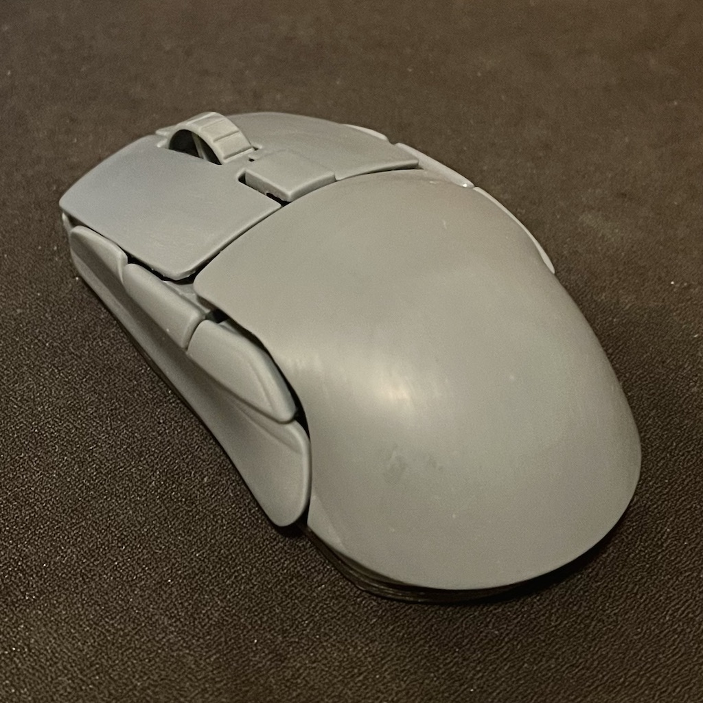
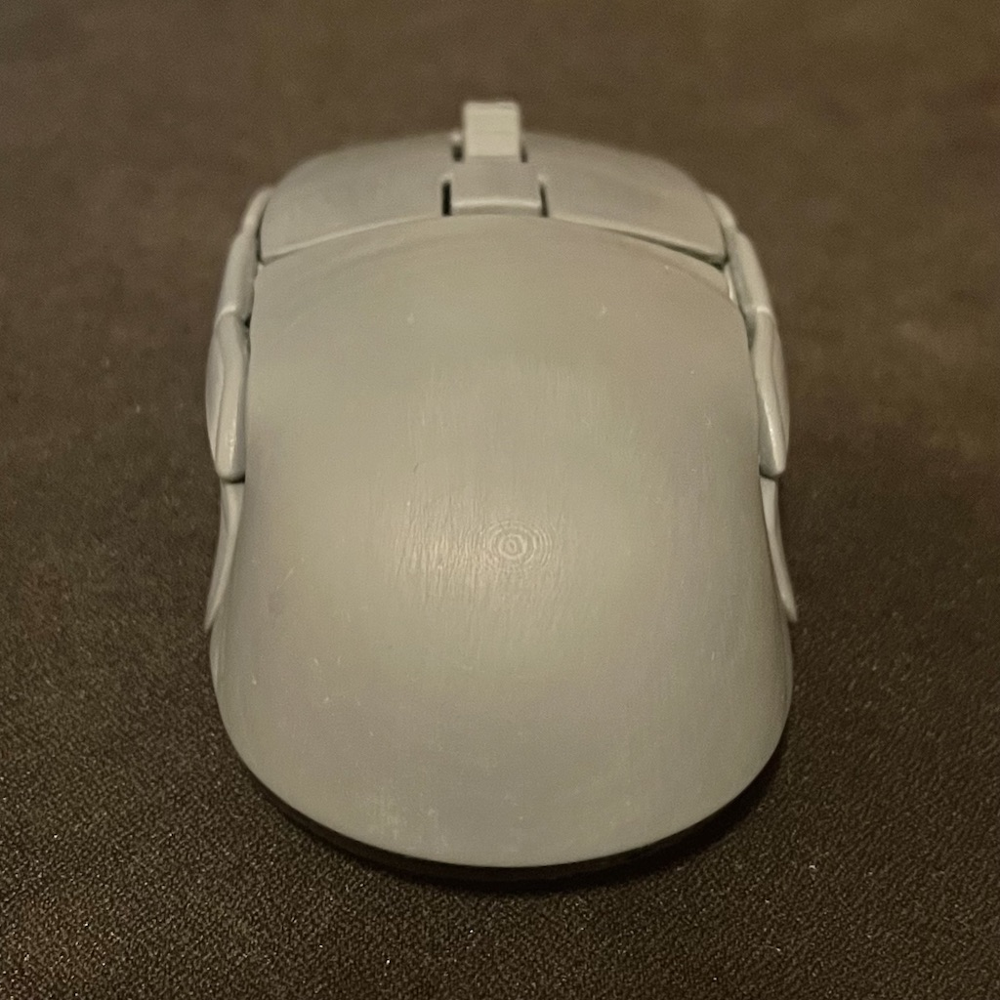
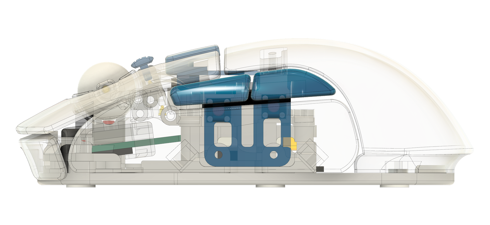

# leylabella

### design principles
- symmetrical computer mouse
- all gripping surface covering with unique curvy descent, generate unique touch memory of gripping, amplify awaring of grip slip to reduce grip adjustment duration
- narrowing frontend bottom, increase pinky side friction, enhance lift and pitch control for flick movement
- 8 customisable buttons
- not-too-bad middle click
- able to trigger side button by squeezing the stams of thumb or ring finger, ensure fingertip does not need to slip around
- no visible screws
- adjustable surface sensor position. with PAW3395 breakout pcb. https://github.com/badjeff/paw3395-pcb
- mini finger trackball. with PMW3610 breakout pcb. https://github.com/badjeff/pmw3610-pcb
- mechnical trackball tightness control
- powered by [ZMK](https://github.com/zmkfirmware/zmk) => OSS, on-devie profiling, say no to (logxtxxh|razxx) eco-system
- magnetic hotswap palm rest (optimized for all grip style)
- medium size (claw grip @ 112mm x 61mm x 38mm; palm grip @ 117mm x 61mm x 38mm)
- rigid. (Zero crackly sound)
- stupidly easy facelifting. (see CAD file, open soruced, playback the timeline)
- ligthweight. (Errr, under 80g, made by PLA body with two sensors)
- fair battery life
- silent tactile switches
- conventional scroll wheel option

### gallery

https://github.com/user-attachments/assets/b8692ff0-01a4-4cb0-a1dc-d5b0ee7fba73

### bom
|unit|item|
|-|-|
|1|Seeed Studio XIAO BLE (nRF52840)|
|1|PAW3395 Sensor with LOAE-LSI1 Lens [Breakout Board](https://github.com/badjeff/paw3395-pcb)|
|1|PWM3610 Sensor with LM18-LSI Lens [Breakout Board](https://github.com/badjeff/pmw3610-pcb)|
|8|Kailh CMI627301D07 6x6x7.3mm Silent Micro Switch|
|8|1N4148W T4 SOD-123 Diode|
|1|15mm Diameter Delrin POM Ball|
|5*|Pogo pin (2mm diameter x 2.5mm height)|
|3*|2mm static ceramic bearings (embedded in trackball socket)|
|1*|ALPS EC05-E1220401 (Vertical) Rotary Encoder|
|1|MSK-1153 6 Pins Power Switch|
|1|3x4x2mm Tact Switch Turtle Switch|
|1|M2 Screw Boxset (3-10mm)|
|4**|M2 Spacer 4mm diameter|
|4**|M2 Silicon O-ring|
|8|Neodymium Disc Magnets 5x1mm (Diameter x Thick)|
|1|601230 Lipo Battery (plus connector)|
|6|Thick Mouse Feet Skates Dots (~0.7mm)|
|1|30/28/26 AWG silicone wire|
|***|M2 Heat set inserts. ideal size: 3mm diameter x 3mm height.|

*: pogo pin and static ceramic bearings for trackball variant only. rotary encoder for scroll wheel variant only.

**: to implement PAW3395 sensor position adjustable from bottom of the body after assemble, o-rings and spacers are used to secure sensor breakout pcb on chassis.

***: need few heat set inserts if parts are going to be resin printed. all screw holes would fit m2 screws by design, requires to un-supressed feature in fusion360 CAD file to enlarge some m2 screw holes and count how many insert is needed.

### building guide / tips

- NOT for beginner. Requiring experience of building at least one wireless keyboard on [ZMK](https://github.com/zmkfirmware/zmk).
- print chassis plate with PLA, easier to screw
- print trackball socket with resin printing
- lens-to-Surface distance must >1mm & <2mm. Assuming all mouse feet is ~0.65mm thick.
- both optical sensor breakout pcb (and its lens) has the same width and height, that both can fit in the sensor rail. Therefor, surface facing sensor would be swapped to PMW3610 (yeah, dual 3610 build) if +0.5mm to all mouse feet regarding different lens focus distance.

### firmware

the ZMK firmware config repository can be find at [badjeff/leylabella-zmk-config](https://github.com/badjeff/leylabella-zmk-config).

## license

available under the [CERN-OHL-P v2](/LICENSE) permissive license.

=================
+++++++++++++++++ 

добавил внизу возможный TODO, и ссылки & названия где и откуда фича.

PWM3610 сенсор как вариант, но удачи найти недорого в партии меньше 10шт; сравнимо с готовыми мышками на paw3395 <10$ находил на Озон/wb - дефендер какой-то по акции и тп.

*Не нашел тут:***

- схемы антидребезга как в проекте Wx-Mouse (https://forums.overclockers.ru/viewtopic.php?t=330808) https://en.wikipedia.org/wiki/Bus-holder. https://pic.mysku-st.net/uploads/pictures/06/40/74/2018/08/14/7e2e41.png Это 3 проводное подключение микриков с BUSS-keeper, использующим все три контакта кнопки. Результат — абсолютно бездребезговая кнопка, без дабл-кликов при износе или «несущественном браке».   Если уж выбраны механические микрики >> позволит надолго отсрочить даблклики, ускорить скорость срабатывания почти до оптических(без примитивного програмного простаивания во время дребезга).

- варианта с настраиваемой точкой срабатывания микриков и тп rapid trigger с магнитных клавиатур -  пару пинов ADC найдется на подобное. как в недавних топ logitech мышках (там явно с магнитных клав вдохновлялись, и магнитные клавы давно в опенсурсе есть).
Кстати, легко модифицируется вклеиванием 2мм магнитиков, HE сенсоры срабатывают на довольно узеньком участке, т.е. можно даже а-ля MMO райзер нага и тп g600  (c 9-12+ доп кнопок) нашпиговать, с мультиплексором. но будет жрать как не в себя... Тогда только усложнять питанием HE сенсоров через полевики (+сложность и +место) и или на tmr сенсоры переходить (но редко и дорого!)

- хотсвапа на микрики как на Asus ROG (но где-то видел даже более подходящие корпуса), а лучше на все микрики хотсвап, т.к. микрики дохнут кругом, а не только двоят-троят под л.кн и пр.кн, но и дохнут под скроллом, слева кнопки вперед-назад...

- наклоны колеса >> +2 микрика по бокам!

- быстрый доступ к потрохам для хотсвапа? 

- погуглить все обзоры и комментарии про самый удобный корпус с заводским хотсвапом, пока, имхо, g603 вариант неплох с кастомными платками хотсвапа, но там только 2 микрика с ним(

- модульности, сейчас общая плата со всем( Но если мышка мелкая и хотсвап есть норм, т.к. разъемы тоже место занимают! а так уместится в а-ля ноутбучную. на какой-то мышке снизу и внутри выдвижные слайдеры с разными микриками (включая безшумный микрик второй, и ты сдвигать мог выбирая. тогда точно модульность нужна.

- оптических скроллов>> перерисовывать все вокруг них, сам скролл тоже. Но вроде бы находил комментарии, что просто энкодер чуть другой ставили где-то, внешне очень похожий на дефолтные кругом EC11 и тп, но опто-механические; тогда подойдут обычные колесики, универсальнее, ! 
+под готовые кастомные металлические скроллы g305/g70x с ali  https://aliexpress.ru/popular/g305-scroll-wheel корпус перепроектировать, благо недорого!

- магнитные скроллы, как был в магнитной клаве Riskeyboard70. https://github.com/riskable/riskeyboard70 понадежнее оптики будет, если опилками металлическими и тп не забивать. оптика забивалась волосами кошек очень быстро и неотвратимо на оптических энкодерах.

- варианта с безконечным скроллом/электромагнитным скроллом, используя запчасть Logitech MX (и тп Razer DeathAdder? у кого-то еще видел подобный скролл. но дорого(1к+ запчасть); + места дофига займет >> перекомпоновка опять. и вопрос нафига оно мне; но по отзывам в дешевых офисных логитеках с 1000+ dpi  и тп было говно, не настраиваемо, потому полубезполезно. стойкое привыкание вызывало только в топ мышках - там все и вся настраивалось) Но не все варианты такого имеют боковые наклоны колеса.

- дисплей с % зарядки и тп (-1 пин ADC! либо +мультиплексор!).
- корпус-скелетон бионический как у GravaStar, как вариант свапнуть потроха в корпус мыши GravaStar - там механика кругом и микроконтроллеры какое-то говно, вроде бы(

- еще когда-то видел гибкую муфту с оси скролла на механический 
энкодер, в обзоре писалось помогает гасить перегрузки от ударов и тп, чтоб дольше прослужило. насколько помогало - вопрос. Но это полумера, хотя не знаю как четкие отсечки получить не усложняя конструкцию, на не механических скроллах.

- +добавляли в EC HHKB кастомную плату  (https://hhkb.xorlink.com/logitech_flow) эмуляцию Logitech Flow - тоже крутая фича, но не поделятся в опенсурс, наверное(, да и ставить тот тяжеленный блоатваре софт от логитеч на пк ******.
